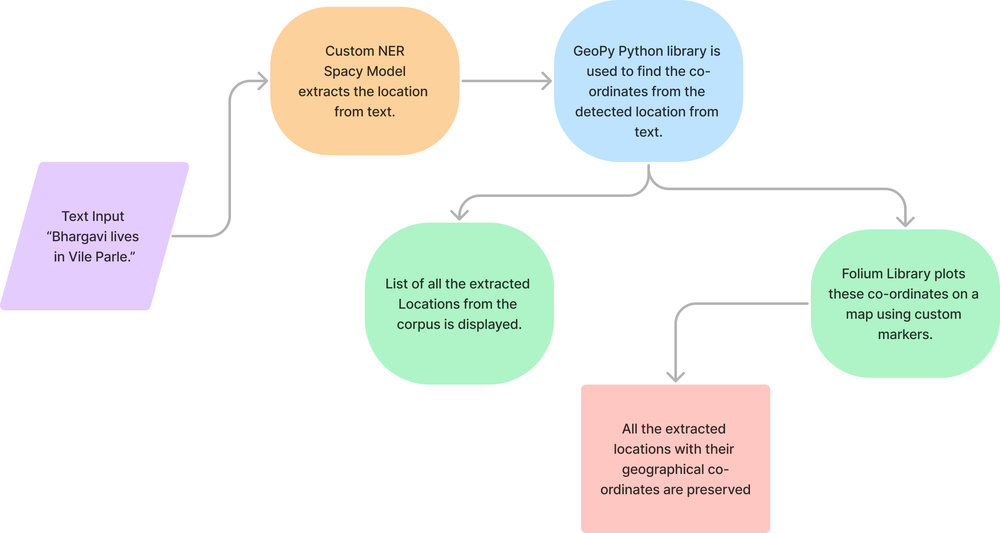
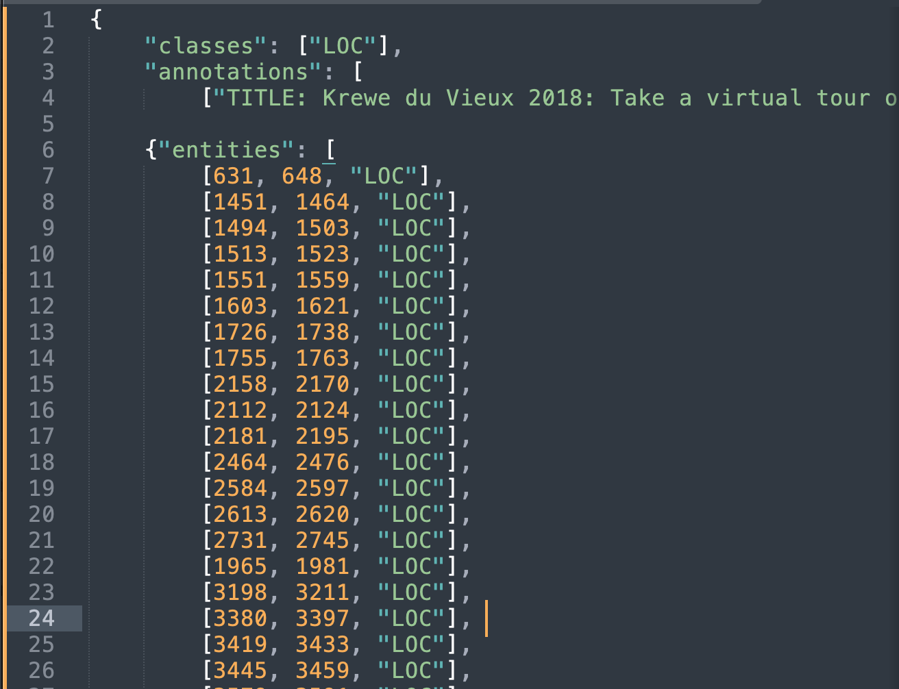

### D2K_NotDecided

Run `D2K_NotDecided_final.ipynb` to view final results.

To install the dependencies, use the command `pip install -r requirements.txt`

To run the streamlit application, use the command `streamlit run main.py`

Below is the format of the dataset after processing
 